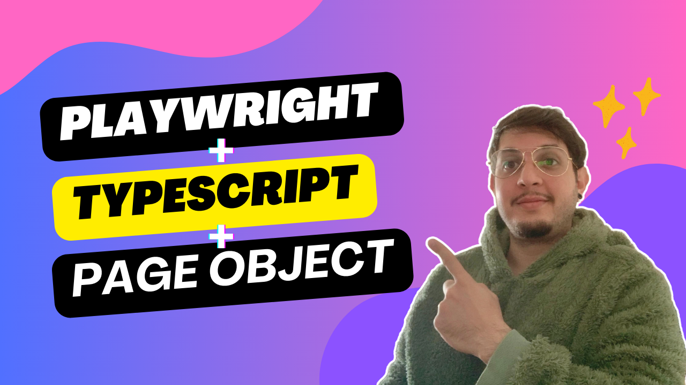

# **Playwright + TypeScript + POM: Ultimate Guide to Test Automation**

[](https://youtu.be/PHJ0tzIRAek)

🚀 This repository contains test automation for the website Parabank Parasoft using **Playwright, TypeScript and Page Object Model (POM)**. 

⚒️ CI/CD: Integration with GitHub Actions: https://github.com/matheus-beck-qa/playwright-typescript-pom-tutorial/actions/runs/14045362385

In the video above, I'll show you:
- How to automatically generate tests using Codegen.
- How to create a reusable authentication setup.
- How to implement a retry register mechanism.
- How to use the Faker.js library to generate random test data.
- How to skip tests based on previous executions.
- How to clean a user session file before each test execution.

---

## **⚙️ Running the Tests**

Make sure to have Node.js v16 or higher installed

1. Clone this repository:
   ```sh
   git clone https://github.com/matheus-beck-qa/playwright-typescript-pom-tutorial.git
   cd playwright-typescript-pom-tutorial
   ```
2. Install all dependencies and run tests:
   ```sh   
   npm install
   npx playwright test
   ```


## **📢 Contributions & Feedback**

Feel free to **open issues** or **submit pull requests** if you want to improve the tests or suggest optimizations! 🚀
